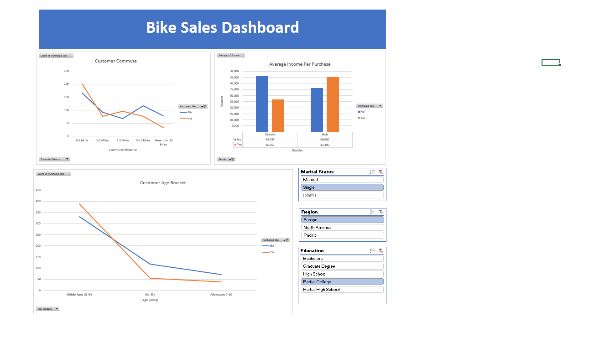

# bike_sales_excel_dashbaord

## Project Overview
This project demonstrates an interactive dashboard built in Microsoft Excel to analyze bike sales data.

## Tools Used
- Microsoft Excel
- Pivot Tables
- Pivot Charts
- Slicers

## Key Steps
- Data cleaning (removed duplicates, standardized values)
- Data transformation (created age groups, formatted fields)
- Built pivot tables
- Created an interactive dashboard

## Insights
- Income influences bike purchase decisions
- Commute distance impacts buying behavior
- Demographics affect trends

## Dashboard Preview

## ℹ️ Note
The dataset and Excel file are not included in this repository.
This project is based on a guided tutorial and is shared for learning purposes.
